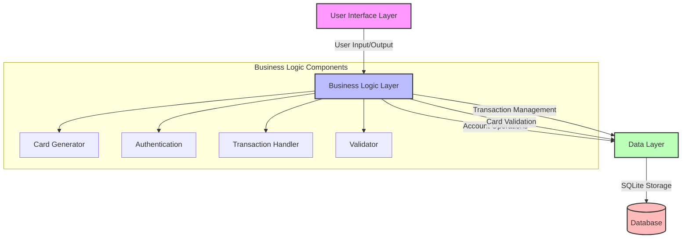
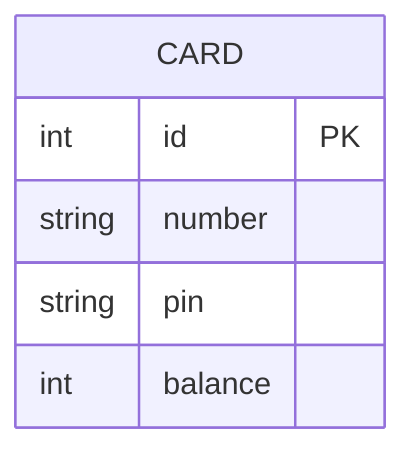
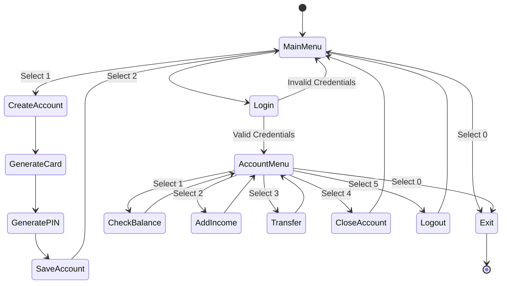
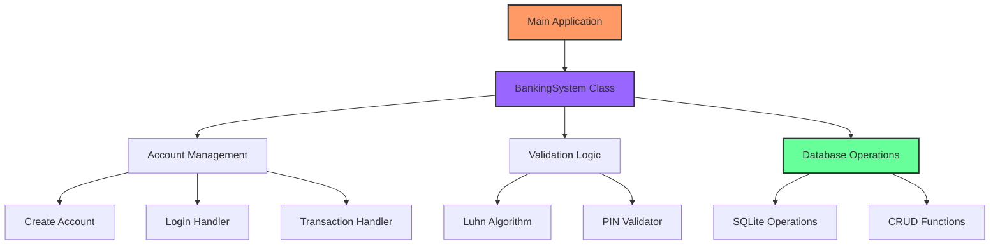

# 🏦 Advanced Banking System

A robust Python-based banking system simulation that implements real-world banking operations with secure card management and transaction handling. This project showcases modern software development practices, including SQL database integration, secure payment card validation (Luhn algorithm), and object-oriented programming principles.

## 🌟 Features

- 🔐 Secure account creation with PIN protection
- 💳 Credit card number generation with Luhn algorithm validation
- 💰 Balance management and transactions
- 🔄 Money transfers between accounts
- 📊 SQLite database integration for persistent storage
- 🛡️ Account closure functionality
- 💵 Income addition capability

## 🏗️ System Architecture

### Component Diagram


### Database Schema


## 🔄 User Flow



## 🛠️ Technical Implementation

### Card Number Generation Process


### Luhn Algorithm Implementation
The system implements the Luhn algorithm (also known as the "modulus 10" or "mod 10" algorithm) for credit card number validation:

1. Double every second digit from right to left
2. If doubling results in a two-digit number, add those digits together
3. Add all single-digit numbers together
4. If the total modulo 10 is equal to 0, the number is valid

## 🔐 Security Features

- PIN encryption
- Luhn algorithm validation
- Session management
- SQL injection prevention
- Balance protection mechanisms

## 🚀 Getting Started

1. Clone the repository:
```bash
git clone https://github.com/armanruet/Simple-Banking-System.git
```

2. Install dependencies:
```bash
cd Simple-Banking-System
pip install sqlite3
```

3. Run the application:
```bash
python adv_banking.py
```

## 💡 Usage Examples

### Creating a New Account
```python
1. Create an account
2. Log into account
0. Exit
> 1

Your card has been created
Your card number:
4000009455217826
Your card PIN:
6948
```

### Making a Transfer
```python
1. Balance
2. Add income
3. Do transfer
4. Close account
5. Log out
0. Exit
> 3

Enter receiver's card number:
> 4000003305160034
Enter how much money you want to transfer:
> 500
Success! Money has been transferred.
```

## 🔍 Code Structure



## 🛣️ Future Roadmap

- [ ] Multi-currency support
- [ ] Transaction history
- [ ] Account statements
- [ ] Interest calculation
- [ ] Joint accounts
- [ ] Mobile number linking
- [ ] Email notifications
- [ ] Two-factor authentication

## 🤝 Contributing

Contributions are welcome! Please feel free to submit a Pull Request. For major changes, please open an issue first to discuss what you would like to change.

## 📝 License

This project is licensed under the MIT License - see the [LICENSE](LICENSE) file for details.

## 🙏 Acknowledgments

- SQLite for providing a robust embedded database
- The Python community for excellent documentation
- Contributors who helped improve the codebase

## 📞 Contact

For any queries or suggestions, please reach out to:
- Email: armanruet@gmail.com
- LinkedIn: [armanruet](https://www.linkedin.com/in/armanruet/)

---
Made with ❤️ by [Arman](https://armanruet.github.io/)